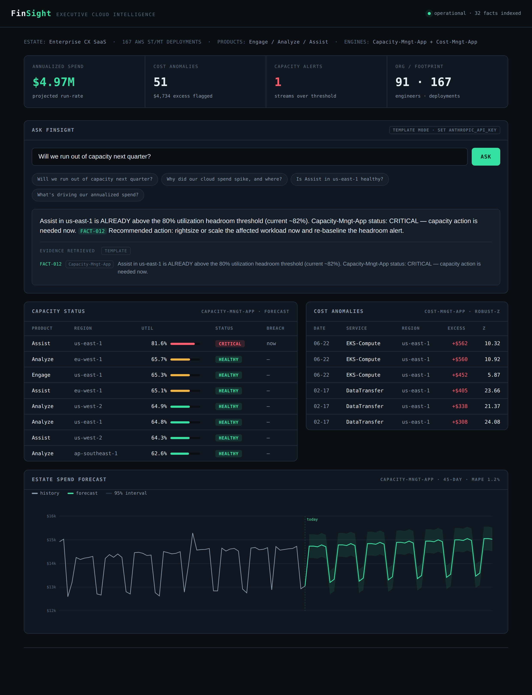

# FinSight — Executive Cloud Intelligence Layer

> Ask your cloud estate a question in plain English. Get a grounded, cited answer.

FinSight unifies two production-style AIOps engines behind a retrieval-augmented
conversational layer, so a CXO or PE investor can ask —

> *"Are we going to run out of capacity next quarter, and why did our cloud bill move?"*

— and get a **decisive, cited** answer where every number traces back to a model
that actually computed it.

This is the capstone proof-of-work for **UC Berkeley Executive Education —
Artificial Intelligence & GenAI: Business Strategies and Applications**, grounded
in a representative Enterprise CX SaaS estate (167 AWS deployments, ~$5M annual
cloud spend, products Engage / Analyze / Assist).

---

## The three engines

| Engine | Executive question it answers | AI/ML technique |
|---|---|---|
| **Capacity-Mngt-App** | *Will we run out of headroom? What will it cost?* | Supervised **time-series forecasting** — ridge regression on engineered temporal features (trend, day-of-week, weekly Fourier terms) with a prediction interval and threshold-breach detection |
| **Cost-Mngt-App** | *Where did the money go? Is it a problem?* | Unsupervised **anomaly detection** — robust z-score on a rolling median + MAD baseline — plus deterministic **cost attribution** |
| **RAG layer** | *Answer me in plain English, with proof* | **Retrieval-augmented generation** — TF-IDF retrieval over engine-derived fact cards, grounded LLM composition (Anthropic Claude) with a deterministic fallback |

### The grounding contract

The deterministic engines own **every number**. The language model only **phrases**
them. The RAG layer can cite *only* facts the engines computed — and an off-domain
question is declined rather than answered with dressed-up irrelevant facts. This is
the anti-hallucination guarantee that makes the assistant safe to put in front of
finance. It is enforced in code (a retrieval relevance floor) and verified in tests
(`test_rag_answers_are_grounded`, `test_rag_declines_when_no_facts`).

---

## Architecture

```
                       ┌─────────────────────────────────────────────┐
                       │            Executive Cockpit (HTML)          │
                       │   KPIs · capacity table · anomaly feed ·     │
                       │   spend forecast · "Ask FinSight" box        │
                       └───────────────────────┬─────────────────────┘
                                               │  REST / JSON
                       ┌───────────────────────┴─────────────────────┐
                       │              FastAPI  (api/main.py)          │
                       │  /overview /capacity /anomalies /forecast    │
                       │  /ask  ◄── RAG                               │
                       └───────────────────────┬─────────────────────┘
                                               │
        ┌──────────────────────┬───────────────┴──────────────┬──────────────────────┐
        ▼                      ▼                              ▼                      ▼
┌───────────────┐    ┌──────────────────┐         ┌────────────────────┐   ┌──────────────┐
│   Capacity-Mngt-App   │    │   Cost-Mngt-App   │         │  Knowledge Base    │   │     RAG      │
│  forecasting  │    │ anomaly + attrib │ ──────► │  fact cards from   │ ─►│ retrieve +   │
│  (time-series)│    │ (robust stats)   │         │  engine outputs    │   │ compose+cite │
└───────┬───────┘    └────────┬─────────┘         └────────────────────┘   └──────────────┘
        │                     │
        └──────────┬──────────┘
                   ▼
        ┌─────────────────────┐
        │  Synthetic data gen  │  deterministic (seed=42) AWS billing + utilization
        └─────────────────────┘
```

---

## Quickstart

```bash
# 1. Install
pip install -r requirements.txt

# 2. (optional) enable fluent LLM answers — without this, FinSight runs in
#    deterministic template mode and still works end-to-end
export ANTHROPIC_API_KEY=sk-...

# 3a. Explore the reproducible notebook
jupyter notebook notebooks/FinSight_Walkthrough.ipynb

# 3b. …or launch the executive cockpit
uvicorn api.main:app --reload --port 8000
# open http://localhost:8000

# 4. Run the tests (proves the engines + the grounding contract)
PYTHONPATH=src pytest tests/ -v
```

---

## The cockpit



A dark instrument-panel control plane that consumes the same engines:
the KPI strip, the Capacity-Mngt-App capacity table (worst-first, with the CRITICAL
Assist / us-east-1 stream flagged), the Cost-Mngt-App anomaly feed with
root-cause tooltips, the estate spend forecast, and the **Ask FinSight** box —
every answer rendered with its inline `[FACT-xxx]` citations and the evidence
it retrieved.

---

## Repository layout

```
finsight/
├── src/finsight/
│   ├── data_generator.py     # deterministic synthetic AWS billing + utilization
│   ├── capacity_mngt_app.py  # time-series forecasting + threshold breach detection
│   ├── cost_mngt_app.py      # robust anomaly detection + cost attribution
│   ├── knowledge_base.py     # builds grounding fact cards from engine outputs
│   └── rag.py                # TF-IDF retrieval + grounded LLM composition
├── api/
│   ├── main.py               # FastAPI cockpit backend
│   └── static/index.html     # executive cockpit UI
├── notebooks/
│   └── FinSight_Walkthrough.ipynb   # reproducible end-to-end walkthrough
├── tests/
│   └── test_finsight.py      # engines + grounding-contract tests (14 tests)
├── docs/                     # cockpit screenshots
├── requirements.txt
└── README.md
```

---

## Why these technique choices (the interview answer)

- **Why ridge regression, not an LSTM, for Capacity-Mngt-App?** On ~180 daily points,
  a regularized linear model on engineered temporal features is the right tool on
  the *jagged frontier*: interpretable, fast, reproducible, and its residual
  variance yields an honest prediction interval. An LSTM would overfit and obscure
  *why* the forecast says what it says. Capacity governance needs an auditable
  forecast, not a black box.

- **Why MAD-based detection, not an autoencoder, for Cost-Mngt-App?** A robust
  z-score on a rolling median + MAD baseline resists the very spikes it hunts —
  the baseline doesn't get poisoned by the anomaly. And finance must see *why* a
  charge was flagged; interpretability is a feature, not a compromise.

- **Why RAG over engine outputs, not over raw rows?** An executive question is
  answered by *derived* facts (a forecast, an anomaly, an attribution), not by
  15,000 raw billing rows. Indexing the derived facts keeps retrieval relevant
  and makes the grounding contract enforceable: the model can only cite numbers
  the engines actually computed.

---

## Notes

- **Synthetic by construction.** No production data is used. The generator is
  deterministic given `seed=42`, so every run of the notebook, the API, and the
  tests reproduces the same numbers.
- **Graceful degradation.** Retrieval is local TF-IDF (no vector DB service) and
  composition falls back to a deterministic template if no API key is present, so
  a clean clone always runs.

---

*Built as capstone proof-of-work. The intent is a working solution that can be
demoed live and defended in interviews — not a slideware concept.*
