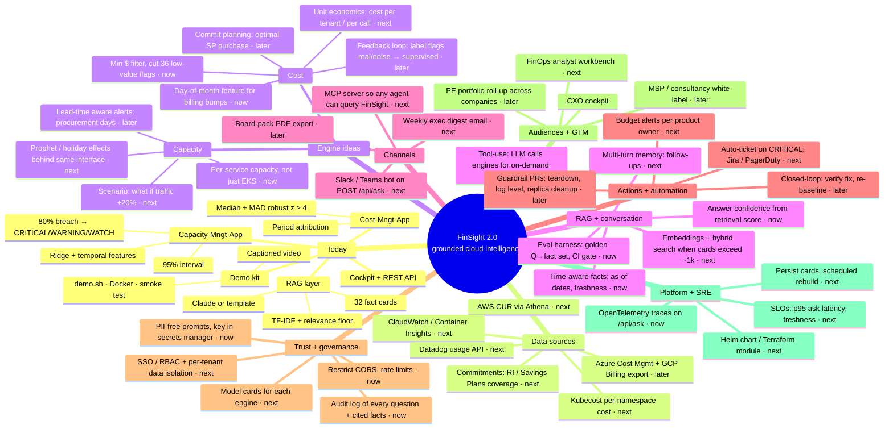

# FinSight 2.0 — Ideation mind map

Use this as a workshop canvas. The centre and first ring describe **what exists today**. The outer branches are **ideas**, each tagged with a horizon:
`· now` small, could ship this sprint · `· next` a quarter · `· later` strategic.

An interactive version (collapsible, filterable by horizon, with an outline view for phones) is at [`docs/interactive/mindmap.html`](interactive/mindmap.html). Open it locally in any browser.
Regenerate it after editing this file with `python docs/interactive/build.py`.

---

## Prompts for the ideation session

1. **Trust:** what's the *one* number a CFO would check first, and is it a fact card yet?
2. **Precision:** 36 of 51 anomaly flags are low-value. What's the right cost of a false positive for this audience?
3. **Action:** for each CRITICAL, who gets paged, and what's the default remediation?
4. **Channel:** where do executives actually ask questions today: Slack, email, or a board pack?
5. **Scale:** at what corpus size does TF-IDF stop being enough? (Measure it; don't guess.)
6. **Moat:** which ideas *strengthen* the grounding contract, and which would weaken it?

## Suggested first sprint (all `[now]`)
| Idea | Effort | Why first |
|---|---|---|
| Golden-question eval harness in CI | S | Locks in grounding quality before anything else changes |
| Min-$ / day-of-month anomaly filter | S | Cuts noise in the most visible panel |
| Audit log of question → cited facts | S | Governance story for finance |
| Answer confidence from retrieval score | S | Lets the UI say "low confidence" before declining |
| OpenTelemetry on `/api/ask` | S | SRE-grade observability of the AI path |
