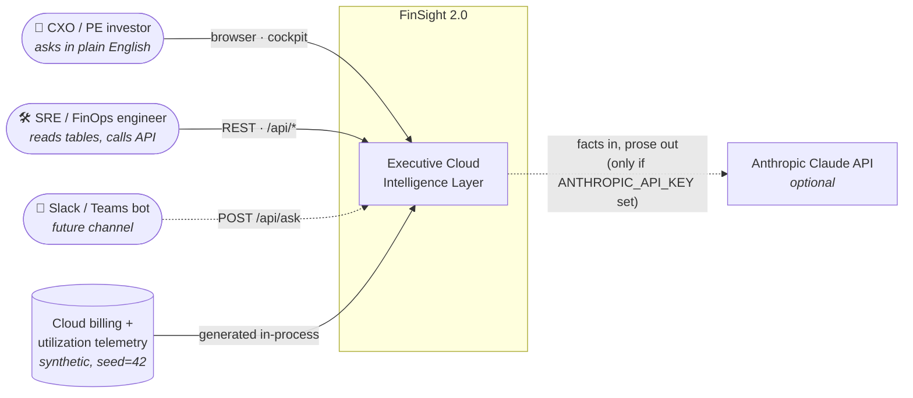
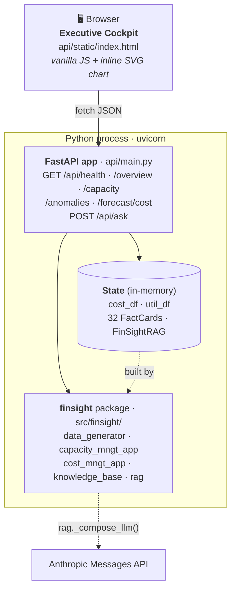
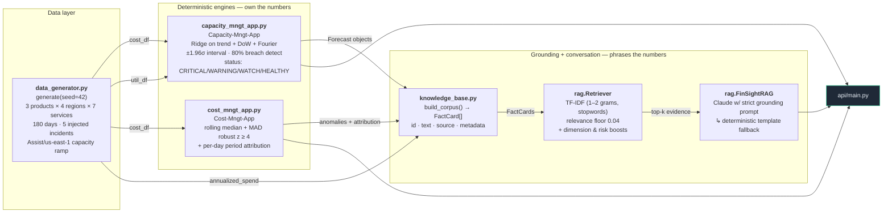
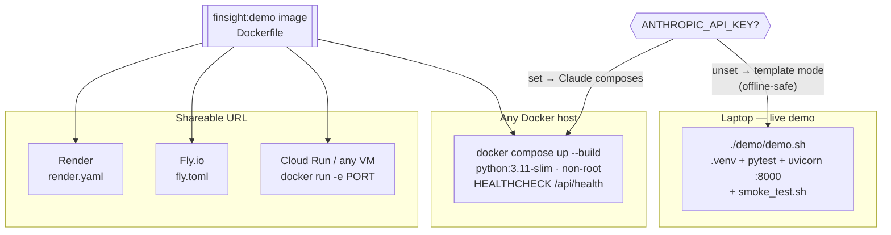

# FinSight 2.0 — Architecture

Four views, from outside to inside: **system context → containers → components → deployment**.
All diagrams are Mermaid and render natively on GitHub.

> One rule shapes everything below: **the deterministic engines own every number; the
> language model only phrases them.** Every box is there to enforce or exploit that.

---

## 1. System context

Who uses FinSight and what it depends on.

---

## 2. Containers

One Python process. Data and engines are built **once at startup** and cached in
`api.main.State`, so every request is read-only and fast.

---

## 3. Components

How the five modules depend on each other. Arrows point from producer to consumer.

### Design decisions at a glance

| Decision | Choice | Why (and what it rules out) |
|---|---|---|
| Forecaster | Ridge regression on engineered temporal features | ~180 points: interpretable, reproducible, honest residual-based interval. An LSTM would overfit and be unexplainable to finance. |
| Anomaly detector | Rolling median + MAD robust z-score | The baseline is not poisoned by the spike it is hunting; every flag is explainable. No labels needed. |
| What RAG indexes | **Derived facts**, not raw billing rows | 32 cards vs ~15k rows: retrieval stays relevant and every citable number was computed by an engine. |
| Retriever | Local TF-IDF + relevance floor | No vector-DB service to run; an off-domain query scores below the floor → empty evidence → honest decline. |
| Composer | Claude with a strict grounding prompt; template fallback | Fluent when a key is present; still works fully offline; never crashes the cockpit. |
| State | Built once at startup, in memory | Deterministic seed → identical numbers across notebook, API, tests and the demo video. |

---

## 4. Deployment options

The same image runs everywhere; `$PORT` is honoured so PaaS platforms need no changes.

See [`demo/deploy/README.md`](../../demo/deploy/README.md) for the exact commands.
