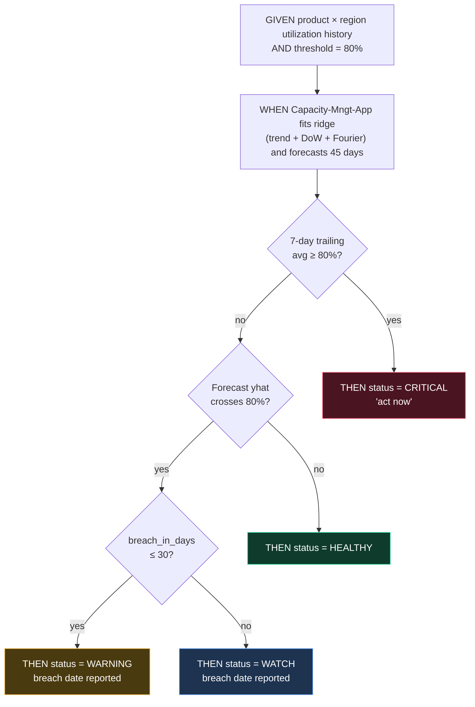
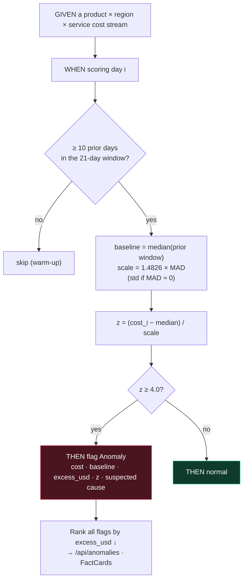
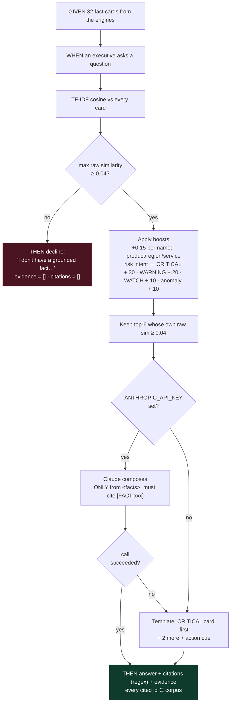
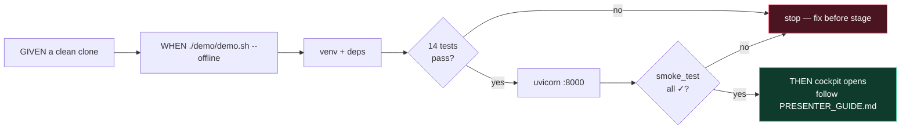

# FinSight 2.0 — BDD Flows

Behaviour is specified in Gherkin under [`docs/bdd/`](../bdd/). This page draws each
feature as a **Given → When → Then** decision flow, then traces every scenario to the test that proves it.

| Feature file | Business question |
|---|---|
| [`01_capacity_forecasting.feature`](../bdd/01_capacity_forecasting.feature) | *Will we run out of headroom?* |
| [`02_cost_anomalies.feature`](../bdd/02_cost_anomalies.feature) | *Where did the money go?* |
| [`03_grounded_rag.feature`](../bdd/03_grounded_rag.feature) | *Can I trust the answer?* |
| [`04_cockpit_and_demo.feature`](../bdd/04_cockpit_and_demo.feature) | *Will the demo work on stage?* |

---

## Flow 1 — Capacity status decision

## Flow 2 — Anomaly detection per point

## Flow 3 — Grounded answer (the contract)

## Flow 4 — Presenter's demo path

---

## Traceability: scenario → proof

| Scenario | Proven by | Type |
|---|---|---|
| CRITICAL stream is flagged | `test_capacity_app_flags_critical_capacity` | unit |
| HEALTHY stream is HEALTHY | `test_capacity_app_reports_healthy_where_expected` | unit |
| Forecast accuracy (MAPE < 8%) | `test_capacity_app_forecast_is_accurate` | unit |
| Interval brackets forecast | `test_cost_forecast_has_interval` | unit |
| Status from days-to-breach (Outline) | `Forecast.status` logic, no dedicated test | **gap** |
| All 5 incidents recovered | `test_cost_app_catches_injected_anomalies` | unit |
| Attribution sums to 100% | `test_cost_app_attribution_sums_to_total` | unit |
| CRITICAL first for risk questions | `test_rag_surfaces_critical_first_for_risk_queries` | unit |
| Every citation is in the corpus | `test_rag_answers_are_grounded` | unit (contract) |
| Off-domain is declined | `test_rag_declines_when_no_facts` | unit (contract) |
| LLM failure → template fallback | `FinSightRAG._compose` try/except, no dedicated test | **gap** |
| Dimension boost (RDS / eu-west-1) | covered by the demo video, Q3 | manual |
| One-command demo, panels, contract pre-flight | `demo/smoke_test.sh` | smoke |
| Container non-root + healthcheck + `$PORT` | verified while building this demo | manual |

**Suggested next tests** (both are small): a parametrised test of `Forecast.status` covering the 30/31-day boundary, and an LLM-fallback test that sets a dummy key and monkeypatches `anthropic.Anthropic` to raise.
