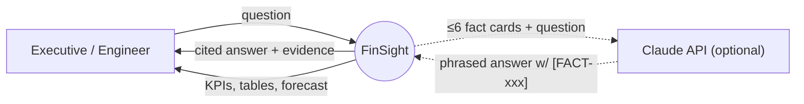
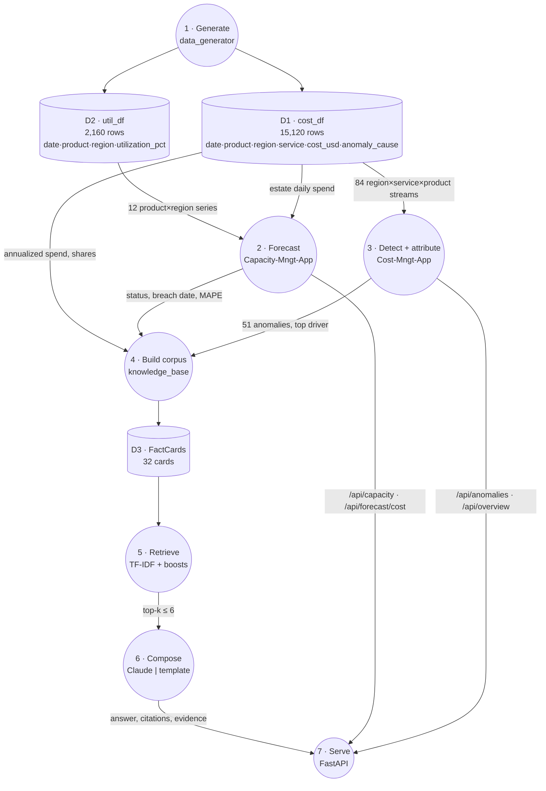
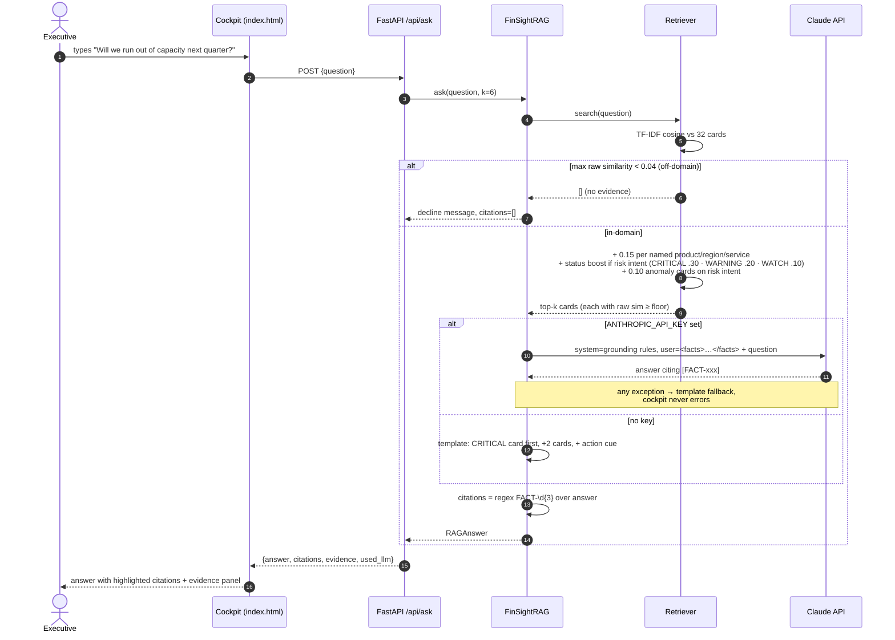
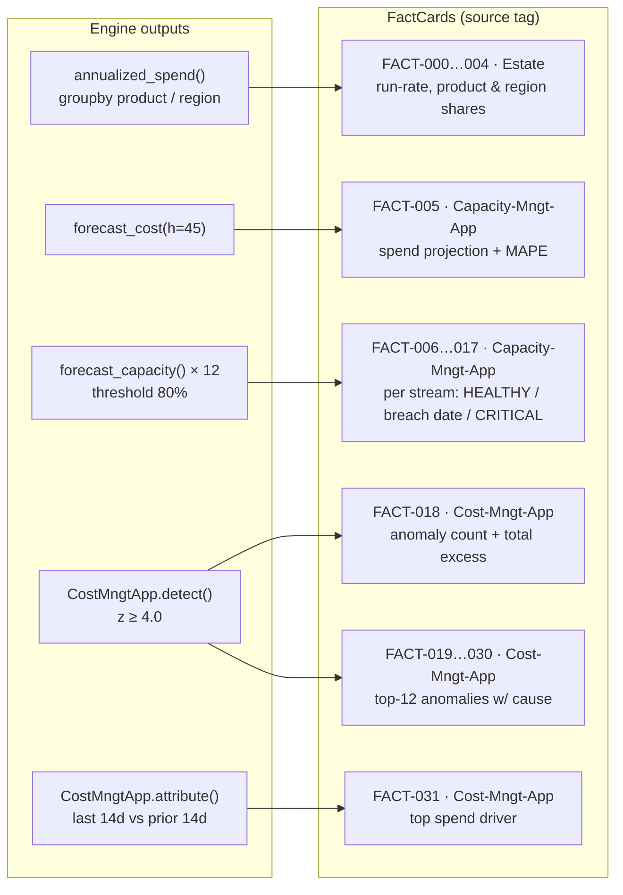
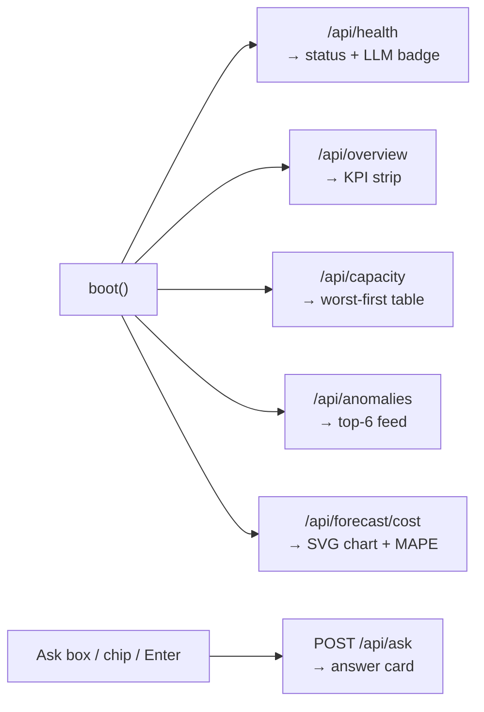

# FinSight 2.0 — Data Flow

How a number gets from raw telemetry to a cited sentence in front of an executive.
Diagrams go from coarse to fine: **DFD level 0 → level 1 → the `/api/ask` pipeline → fact-card lineage**.

Figures quoted are what the default dataset (`seed=42`) produces.

---

## Level 0 — context DFD

---

## Level 1 — processes and data stores

Numbered circles are processes, cylinders are in-memory stores.

| Store | Built | Lifetime | Size (seed 42) |
|---|---|---|---|
| D1 `cost_df` | `generate()` at startup | process | 3 products × 4 regions × 7 services × 180 days = **15,120** rows |
| D2 `util_df` | `generate()` at startup | process | 3 × 4 × 180 = **2,160** rows |
| D3 FactCards | `build_corpus()` at startup | process | **32** cards (5 estate · 13 capacity · 13 anomaly · 1 attribution) |

---

## The `/api/ask` pipeline (sequence)

---

## Fact-card lineage

Every citable number comes from exactly one engine computation.

Each card also carries `metadata` (e.g. `status`, `product`, `region`, `excess_usd`).
The retriever reads metadata to apply boosts. The template composer reads it to pick the lead fact and the action cue.

---

## Cockpit refresh flow

On page load the cockpit fans out five independent calls. A failure in one panel never blanks another.

